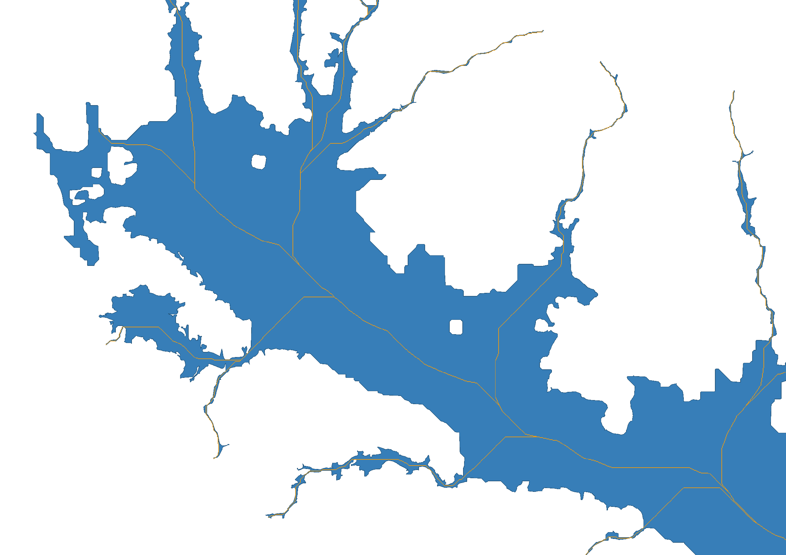

# Valley Axis

Implementation of glacier centerline extraction algorithm from [Kienholz et al. (2014)](https://tc.copernicus.org/articles/8/503/2014/).



## TODO

- [ ] Add option to remove inlets points that are not on the valley floor
- [ ] Add option to remove inlets points that are not near any boundary
- [ ] Allow for multiple outlets

## Installation

```bash
pip install valleyaxis
```

## Usage

Here's a complete example showing how to extract valley centerlines:

```python
import matplotlib.pyplot as plt
import geopandas as gpd
import rioxarray as rxr
from valleyaxis.channel_nodes import find_channel_heads_and_outlets
from valleyaxis import valley_centerlines

# Load input data
dem = rxr.open_rasterio("./sample_data/1805000202-dem.tif", masked=True).squeeze()
flowlines = gpd.read_file("./sample_data/1805000202-flowlines.shp")
floor = gpd.read_file("./sample_data/floor.shp").geometry[0]

# Find channel heads and outlets from flowlines
channel_nodes = find_channel_heads_and_outlets(flowlines)
outlet = channel_nodes.loc[
    channel_nodes[channel_nodes["type"] == "outflow"].index[0], "geometry"
]
inlets = channel_nodes.loc[channel_nodes["type"] == "inflow", "geometry"]

# Extract centerlines
centerline = valley_centerlines(dem, inlets, outlet, floor)
```

## Input Data Requirements

- **DEM**: Digital elevation model (GeoTIFF)
- **Valley Floor**: Polygon shapefile of valley floor extent
- **Channel Points**: Either:
  - Provide inlet and outlet points directly
  - Or provide flowlines to automatically extract channel heads and outlets

## Citation

Kienholz, C., Rich, J. L., Arendt, A. A., and Hock, R.: A new method for deriving glacier centerlines applied to glaciers in Alaska and northwest Canada, The Cryosphere, 8, 503–519, https://doi.org/10.5194/tc-8-503-2014, 2014.
